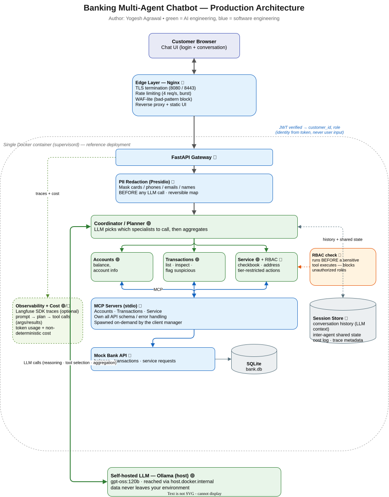

# From a Toy Chatbot to a Production Multi-Agent System: Designing a Secure Banking Assistant

**Author:** Yogesh Agrawal

> How do you take a "simple AI chatbot" and evolve it, decision by decision, into
> something you could actually run inside a bank? This post walks through that
> journey — and backs every step with a working, fully open-source reference
> implementation you can run on one machine with a local LLM.

---

## The problem (why we're here)

A bank's customer-support team takes ~420,000 calls a month. Around 65% are the
same three questions over and over:

- *"What's my account balance?"*
- *"Why was my account debited?"*
- *"My checkbook is finished — can you send a new one?"*

Every one of those is a toll-free call the bank pays for, and every answer is
already sitting in the net-banking app. Customers call anyway, because net
banking has 14+ screens and they can't find anything.

The ask: **a secure, conversational AI assistant** that cuts call volume without
compromising customer experience — or leaking sensitive data.

This is a great teaching case because the *AI* part is the easy 20%. The other
80% is classic software and security engineering. Throughout this post I'll tag
each piece as **🟢 AI engineering** or **🔵 software engineering**, because
knowing the difference is most of the job.

---

## Phase 1 — The naive chatbot

Start simple: a web UI, an API, one agent, one LLM.

```
UI ──> API ──> Agent ──> LLM
```

Ask it "what's my balance?" and it honestly replies: *"Sorry, I don't have
access to your bank accounts."* Correct — it has no connection to any bank
system. Useless, but a correct starting point.

🟢 Prompt + model. 🔵 UI, API.

---

## Phase 2 — Give the agent tools

The bank already exposes internal APIs (balance, transactions, statements,
address change). We let the agent *call* them. The LLM is told which tools exist
and decides which to use:

```
User: "what's my balance?"
  Agent → LLM: here's the question + the list of tools
  LLM  → Agent: call `get_balance(customer_id)`
  Agent → Bank API → balance
  Agent → LLM: turn this into a sentence
  → "Your savings balance is $24,345."
```

This is a **tool-based agent**. It works — until you attach 30–40 real banking
tools to one agent. Then the model gets *tool confusion*: too many choices, wrong
picks.

---

## Phase 3 — Domain sub-agents

Split the one overloaded agent into **specialists**, each holding only its own
tools:

- **Accounts agent** — balances, account info
- **Transactions agent** — list/inspect/flag transactions
- **Service agent** — checkbook requests, address changes, and other
  service/account-maintenance actions (including tier-restricted ones)

Each agent is now sharp and hard to confuse. 🟢

---

## Phase 4 — The coordinator

But what about *"What's my balance **and** my last 5 transactions?"* No single
specialist can answer that. Enter the **coordinator**: a planner that uses the
LLM to decide which specialists to call, invokes them, and aggregates one answer.

```
Coordinator plans: ["accounts", "transactions"]
  → accounts agent    → get_balance
  → transactions agent → list_transactions
  → aggregate → one friendly reply
```

In the reference implementation, that exact query produces the plan
`["accounts", "transactions"]`, calls both tools, and merges the results.

The coordinator is built as a **LangGraph state graph**: a `plan` node, a
conditional **fan-out** to the three specialist nodes (which can run in
parallel), and an `aggregate` node — with RBAC, token accounting, and the
session shared-state threaded through the graph state. LangGraph gives us
explicit routing, parallelism, and a clean place to add cycles (re-planning) or
human-in-the-loop pauses later. The LLM is driven via **ChatOllama** against the
local model, so the whole orchestrator stays local and free.

---

## Phase 5 — MCP: decouple tools from brains

Here's a design smell: our service agent's code is now tangled with API schemas,
auth headers, retries, and error handling for three different endpoints. That's
not the agent's job. The agent should *reason*; something else should *handle
the plumbing*.

So we introduce the **Model Context Protocol (MCP)**. Each domain gets its own
MCP server that owns all the tool/API logic behind a uniform contract. The agent
just talks MCP.

```
Agent ──MCP──> [Accounts MCP] ──> Bank API
          └──> [Transactions MCP] ──> Bank API
          └──> [Service MCP] ──> Bank API
```

Now tools are loosely coupled, independently testable, and swappable. 🔵 (the
server) + 🟢 (the agent still does the reasoning).

> In the implementation these are real MCP servers over stdio, spawned
> on-demand. The agent discovers their tools dynamically and converts them to the
> LLM's function-calling format.

---

## Phase 6 — Authentication & authorization (the part people skip)

Our "working" bot has a terrifying bug. It asks the user for a customer ID — so
**if you know any customer's ID, you can read their account.** That's a data
breach with a chat interface.

**Fix #1 — Authentication (🔵).** Integrate the bank's identity provider. The
user logs in; every request now carries a verified identity. The customer ID
comes from the **token**, never from user input. A customer can only ever see
their own data.

**Fix #2 — Authorization / RBAC (🔵).** Authentication tells you *who* the
customer is. Authorization tells you *what that customer is allowed to do*.
These are different questions, and conflating them is a classic security
mistake. A valid login does **not** mean "allowed to do anything."

In this bank, customers fall into tiers, and each tier can do a different set of
things:

| Capability | Privileged | Premium | Standard |
|-----------|:---------:|:-------:|:--------:|
| Check balance | ✅ | ✅ | ✅ |
| View transactions | ✅ | ✅ | ✅ |
| Flag a suspicious transaction | ✅ | ✅ | ✅ |
| Order a new checkbook | ✅ | ✅ | ✅ |
| Change registered address | ✅ | ✅ | ✅ |
| Increase credit limit | ✅ | ❌ | ❌ |
| Waive a credit-card interest charge | ✅ | ❌ | ❌ |
| Other high-value / privileged actions | ✅ | ❌ | ❌ |

The read-only, low-risk things (balance, transactions) are open to **everyone**
who is authenticated. The sensitive, high-impact actions are gated to the
appropriate tier.

Why does this matter so much? Consider two authenticated users asking for the
exact same thing:

- **`john` — a *privileged* customer.** He asks for a privileged action. The
  system confirms his tier allows it, (optionally) steps up with an OTP, and
  proceeds. ✅
- **`sanjay` — a *standard* customer.** He asks for the *same* privileged action.
  The system checks his tier, sees he isn't permitted, and refuses politely:
  *"Sorry, your account tier isn't permitted to perform that action."* ❌

Same question, same working chatbot, **different outcome** — determined entirely
by the authenticated user's role.

**Where the check happens is the whole point.** A naive implementation would
call the bank API and *then* discover the user wasn't allowed — the sensitive
operation already executed. Here, the role check runs **before** the tool is
ever invoked. If the user's tier isn't permitted, the specialist agent is
*blocked from calling the tool at all*; nothing reaches the bank API, and the
agent returns a clear, human explanation instead.

```
sanjay (standard) → "do <privileged action>"
  coordinator → service agent
  LLM wants to call: <privileged_tool>
  RBAC filter: role 'standard' not permitted  ← blocked HERE
  → bank API never called
  → "Sorry, your tier isn't permitted to do that."
```

In the implementation this is a small, declarative policy: a map of
`sensitive_tool → {roles allowed}`. Anything not in the map is allowed for all
authenticated users; anything in it is checked against the caller's role before
execution. Adding or changing a restricted action is a one-line policy edit, not
a code change scattered across agents.

> 🔒 **The subtle lesson:** the demo *felt* finished after Phase 5, but it was a
> breach waiting to happen. Authentication + authorization aren't an AI feature —
> they're the same 🔵 software-engineering disciplines every production system
> has always needed. AI didn't change the rules; it just gave attackers a
> conversational front door.

### A worked example: "please waive my interest charge"

This capability shows two distinct kinds of rule working together — and why you
should keep them in different places.

Every customer can *see* their credit-card interest charges (read-only). But
asking to **waive** one is a privileged action. Watch how the same request plays
out across tiers:

- **`john` (privileged)** → the waiver tool runs. Now a **business rule** kicks
  in (inside the bank service, not the agent): a charge is **auto-waived only if
  it's the customer's first interest charge in the last 6 months**. If an earlier
  charge exists in that window, it's politely declined.
- **`priya` (premium)** and **`arjun` (standard)** → **RBAC blocks the tool
  before it runs**, and the agent responds: *"I'm not able to waive that — please
  contact a bank representative."* It never reaches the business rule at all.

Notice the clean separation:

- **Authorization (🔵, in RBAC):** *who* may invoke the waiver → privileged only.
- **Business logic (🔵, in the bank service):** *whether* a permitted waiver is
  actually granted → the 6-month first-charge rule.
- **Agent (🟢):** just reasons about the request and, when blocked, turns the
  `not_authorized` signal into a human "contact a representative" message.

Putting the 6-month rule in the agent's prompt would be a mistake — an LLM is
non-deterministic and could be talked out of it. Business rules that must *always*
hold belong in deterministic code; the LLM orchestrates, it doesn't adjudicate.

---

## Phase 7 — Memory (because LLMs are stateless)

A user asks about their last transaction, then says *"flag that one as
suspicious."* The naive bot has no idea what "that" means — LLMs don't remember
previous turns. Worse, it has no record that anything was ever flagged.

**Fix (🔵): a session store.** Persist:
- **conversation history** → fed back into the LLM for context
- **inter-agent shared state** → so one agent can see another's output

Now the three-turn flow works: ask → *"flag that"* (resolves "that" from
history) → *"was that the one I flagged?"* (reads it back). The implementation
verifies exactly this sequence.

---

## Phase 8 — Protecting PII (and a hybrid LLM strategy)

A customer types their full card number into the chat. Our agent is about to
send that to a third-party LLM. We just leaked PII to a vendor.

**Fix #1 — PII redaction (🔵).** Before *any* LLM call — even a local one —
run the text through a redactor that masks cards, phones, emails, names, and
account numbers with reversible placeholders (`<CREDIT_CARD_1>`). The real values
are restored only in the final answer, for the authenticated customer. The
reference build uses **Microsoft Presidio** for this.

**Fix #2 — Hybrid LLM (🟢).** Keep a **self-hosted** open model inside your
security boundary for routine reasoning; only reach for a powerful third-party
model when genuinely needed. (The reference implementation goes 100% local with
Ollama, so nothing ever leaves the box.)

---

## Phase 9 — Evaluation (you can't unit-test a vibe)

A developer tweaks a system prompt — "stop confirming the delivery address" —
and silently breaks checkbook delivery. How would you ever catch that?

**Fix (🟢): an agent evaluation suite.** A golden dataset of tricky prompts plus
a harness that scores *non-deterministically*: structural checks (did it call
the right tools? was the unauthorized tool blocked?) **and** semantic similarity
to a reference answer (because the exact wording will never match). The
implementation ships 6 golden cases scored with embeddings — all passing.

---

## Phase 10 — Observability & cost

A customer disputes a balance the bot gave them. You open the logs and find…
"request in, response out." Nothing about which agent ran, which tool, with what
inputs. You can't debug it. **Never ship this.**

**Fix (🟢+🔵): observability.** Trace every interaction — the prompt, the plan,
each sub-agent, each tool call and its arguments, the LLM parameters. The
reference build integrates the **Langfuse** SDK (optional) plus a cost log.

Traces are grouped by a **session id that is stable from login to logout**: the
UI mints one `session_id` when the user signs in and sends it with every turn,
so in Langfuse a whole conversation shows up as one **Session** containing a
trace per message (each with its plan → tool-call → cost breakdown). Logging out
(there's a **Logout** button) ends the session; the next login starts a fresh
one. This is the difference between "a pile of disconnected traces" and "every
turn of this customer's conversation, in order, in one place."

And because LLM spend is **non-deterministic**, you must **track cost** per
request and alert on spikes — a genuinely new concern that classic apps never
had. 🟢

---

## Phase 11 — The edge

Finally, before any traffic reaches the app, it passes an **edge layer** (🔵):

- **WAF-lite** — block obvious malicious patterns
- **Rate limiting** — e.g. 4 requests/sec/IP, to stop DoS
- **API gateway / reverse proxy** — TLS termination, routing, auth enforcement

The reference build uses **Nginx**: path-traversal attempts get a 403, a burst of
requests gets throttled to 429, and everything else is proxied to the app.

---

## The finished picture



*Editable source: [`docs/architecture.drawio`](docs/architecture.drawio) (open in
[diagrams.net](https://app.diagrams.net) or the VS Code Draw.io extension). A
PNG is also available at [`docs/architecture.png`](docs/architecture.png).*

<details>
<summary>Text version of the diagram</summary>

```
          Browser
             │
        ┌────▼────┐   edge: TLS · rate-limit · WAF-lite
        │  Nginx  │
        └────┬────┘
             │  JWT verified → customer_id, role
        ┌────▼─────────────────────────────┐
        │  FastAPI gateway                  │
        │   └─ PII redaction (pre-LLM)      │
        │   └─ Coordinator (planner)        │
        │        ├─ Accounts agent          │
        │        ├─ Transactions agent      │
        │        └─ Service agent (+RBAC)   │
        └────┬───────────────┬──────────────┘
             │ MCP (stdio)    │ session store (history + shared state)
        ┌────▼────┐           │ cost log · Langfuse traces
        │ 3 MCP   │───> Mock Bank API ──> SQLite
        │ servers │
        └─────────┘
             │
      self-hosted LLM (Ollama)
```

</details>

🟢 **AI engineering:** prompt design, tool selection, the planner, PII
*strategy*, hybrid-model routing, the eval suite, cost awareness.
🔵 **Software engineering:** auth, RBAC, MCP servers, session store, PII
*service*, observability plumbing, edge security.

That ratio — far more blue than green — is the real lesson of productionizing AI.

---

## The reference implementation (free & local)

Everything above is implemented and runnable as a **single Docker container**
driven by a **local Ollama** model. No paid services.

| Concern | Choice |
|---------|--------|
| API / agents | Python 3.11 + FastAPI |
| Orchestration | **LangGraph** state graph |
| LLM | Host **Ollama** (`gpt-oss:120b`) via **ChatOllama** |
| Tools | Official **MCP** SDK (stdio) |
| Bank data | Mock Bank API + **SQLite** |
| Auth | **JWT** + role-based access control |
| PII | **Microsoft Presidio** |
| Observability | **Langfuse** SDK (optional) + cost log |
| Edge | **Nginx** (TLS, rate-limit, WAF-lite) |
| Process mgr | **supervisord** |

```bash
cp .env.example .env
docker compose up --build
# open http://localhost:8080 — log in as  john / password123
```

Try these to see each phase in action:

- *"What is my account balance?"* → routed to the accounts agent
- *"What is my balance and my last 5 transactions?"* → multi-agent plan
- the **same privileged action**, asked by `john` (privileged) vs `sanjay`
  (standard) → **allowed for john, blocked by RBAC for sanjay**
- as `john`: *"Please waive my credit-card interest charge"* → **auto-waived**
  (first charge in 6 months); as `priya`/`arjun` → **forwarded to a bank
  representative**
- *"My card number is 4111 1111 1111 1111"* → PII masked before the LLM

Run the tests (LLM mocked, deterministic) and the live eval:

```bash
PYTHONPATH=. python -m pytest          # 34 unit/integration tests
PYTHONPATH=. python -m eval.run_eval   # non-deterministic agent eval
```

---

## Takeaways

1. **Start embarrassingly simple, then let each real-world failure drive the
   next component.** Every box in that diagram exists because the previous
   version broke in a specific, demonstrable way.
2. **The LLM is the small part.** Auth, authorization, memory, PII, observability,
   cost, and edge security are where production actually lives.
3. **Security is not a phase you bolt on.** The "ask for a customer ID" bug shows
   how an impressive demo can be a breach waiting to happen.
4. **You can learn all of this locally and for free.** A single container plus a
   local Ollama model reproduces the entire architecture end to end.

*The full source accompanies this post. Build it, break it, and watch the logs —
that's where the real understanding is.*
